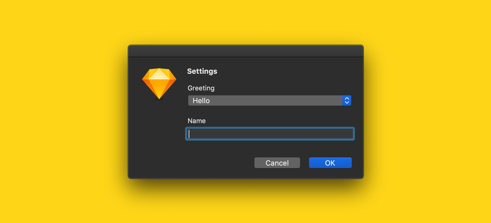

# Getting User Input

- [**Example**](#example)
- [**Get user input**](#get-user-input)
  - [openSettingsDialog(options)](#const-result--opensettingsdialogoptions)
- [**Get settings**](#get-settings)
  - [getSettings()](#const-settings--getsettings)
- [**Save and reset settings**](#save-and-reset-settings)
  - [resetSettings()](#resetsettings)
  - [saveSettings(settings)](#savesettingssettings)
  - [saveTemporarySettings(settings)](#savetemporarysettingssettings)

---

## Example

Specify the `defaultSettings` for your plugin in the `sketch-plugin-helper` key of your `package.json`:

```diff
{
  ...
  "sketch-plugin-helper": {
    ...
+   "defaultSettings": {
+     "greeting": "Hello",
+     "name": "Alice"
+   }
  }
}
```

To retrieve the currently-saved settings, use `getSettings`:

```js
import { getSettings } from 'sketch-plugin-helper'

export default function () {
  // ...
  const settings = getSettings()
  console.log(settings.greeting) //=> 'Hello'
  console.log(settings.name)     //=> 'Alice'
  // ...
}
```

To get and save user input, use `openSettingsDialog` and `saveSettings`:

```js
import {
  openSettingsDialog,
  saveSettings,
  DROP_DOWN,
  TEXT_BOX
} from 'sketch-plugin-helper'

export default function () {
  // ...
  const options = {
    title: 'Settings',
    formFields: [
      {
        type: DROP_DOWN,
        key: 'greeting',
        label: 'Greeting',
        possibleValues: ['Hello', 'Goodbye']
      },
      {
        type: TEXT_BOX,
        key: 'name',
        label: 'Name'
      }
    ]
  }
  const result = openSettingsDialog(options)
  if (result === null) {
    return
  }
  saveSettings(result)
  console.log(result.greeting) //=> 'Hello' or 'Goodbye'
  console.log(result.name)     //=> A string
  // ...
}
```

This gives the following:



---

## Get user input

```js
import {
  openSettingsDialog,
  CHECK_BOX,
  DROP_DOWN,
  RADIO_BUTTONS,
  TEXT_BOX,
  NUMERIC_TEXT_BOX
} from 'sketch-plugin-helper'
```

### const result = openSettingsDialog(options)

Opens a dialog with one or more form fields as specified in the given `options`.

#### *Return value*

- If the <kbd>OK</kbd> button was clicked, then `result` is an `object` containing the user input.
- If the <kbd>Cancel</kbd> button was clicked, then `result` is `null`.

#### *Parameters*

- `options` (`object`)
  - `options.title` (`string`) is the title of the dialog.
  - `options.formFields` (`object[]`) is an array of configuration objects corresponding to each form field.

Each form field configuration object in `options.formFields` has the following mandatory keys:
- `type` (`string`) is one of `CHECK_BOX`, `DROP_DOWN`, `RADIO_BUTTONS`, `TEXT_BOX`, or `NUMERIC_TEXT_BOX`.
- `key` (`string`) is an identifier for the form field. The value of the form field will be stored in `result` based on the `key`.
- `label` (`string`) is the label for the form field.

Fields of type `DROP_DOWN` and `RADIO_BUTTONS` also require a `possibleValues` (`array`) key.

The different types of form fields and their corresponding values in the `result` object are as below:

Type | Description | Value in `result`
:--|:--|:--
`CHECK_BOX` | For boolean input | Either `true` or `false`
`DROP_DOWN` | For restricting input to a particular set of `possibleValues` | A value from the `possibleValues` array
`RADIO_BUTTONS` | For restricting input to a particular set of `possibleValues` | A value from the `possibleValues` array
`TEXT_BOX` | For free-text input | A `string`
`NUMERIC_TEXT_BOX` | For free-text, numeric input | A `number`

#### *Example*

```js
export default function () {
  // ...
  const options = {
    title: 'Settings',
    formFields: [
      {
        type: CHECK_BOX,
        key: 'foo',
        label: 'Foo'
      },
      {
        type: DROP_DOWN,
        key: 'bar',
        label: 'Bar',
        possibleValues: [1, 2, 3]
      },
      {
        type: RADIO_BUTTONS,
        key: 'baz',
        label: 'Baz',
        possibleValues: ['x', 'y']
      },
      {
        type: TEXT_BOX,
        key: 'qux',
        label: 'Qux'
      },
      {
        type: NUMERIC_TEXT_BOX,
        key: 'biz',
        label: 'Biz'
      }
    ]
  }
  const result = openSettingsDialog(options)
  if (result === null) {
    return
  }
  console.log(result.foo) //=> true or false
  console.log(result.bar) //=> 1, 2 or 3
  console.log(result.baz) //=> 'x' or 'y'
  console.log(result.qux) //=> a string
  console.log(result.biz) //=> a number
  // ...
}
```

---

## Get settings

```js
import { getSettings } from 'sketch-plugin-helper'
```

### const settings = getSettings()

Returns the currently-saved plugin settings.

#### *Return value*

- `settings` is an `object`.

---

## Save and reset settings

```js
import {
  resetSettings,
  saveSettings,
  saveTemporarySettings,
} from 'sketch-plugin-helper'
```

### resetSettings()

Resets all plugin settings to the `defaultSettings` as specified in the `sketch-plugin-helper` field of your `package.json`.

---

### saveSettings(settings)

Saves the given `settings` permanently; settings are persisted even after Sketch is closed.

#### *Parameters*

- `settings` (`object`)

---

### saveTemporarySettings(settings)

Saves the given `settings` to be persisted for the current “session” only; settings are *not* persisted after Sketch is closed.

#### *Parameters*

- `settings` (`object`)
